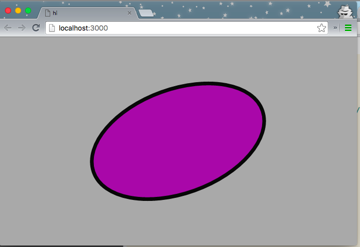
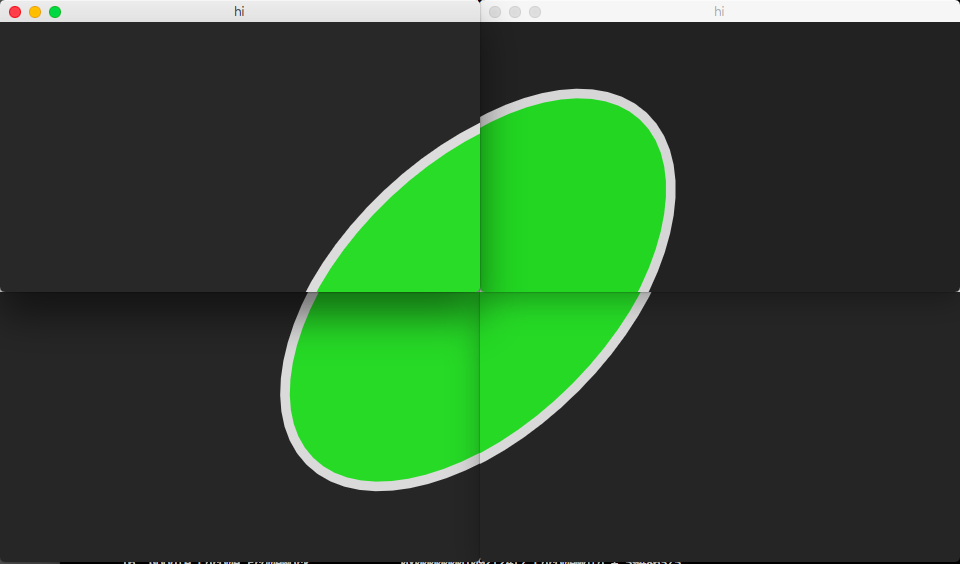
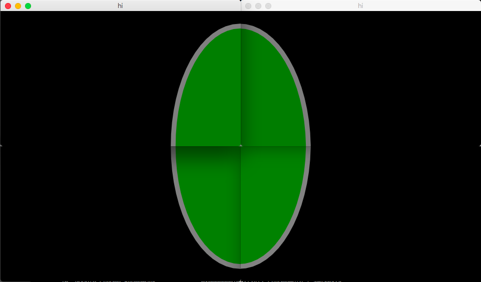
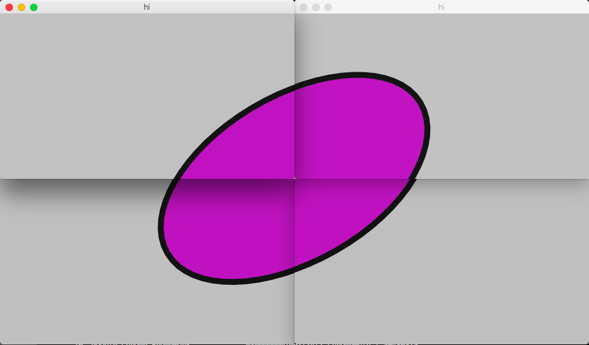

<script src="http://cdnjs.cloudflare.com/ajax/libs/p5.js/0.4.23/p5.js"></script>

# Chicago Brick P5 Surface Codelab

* TOC
{:toc}

Chicago Brick ships with a [p5js](http://p5js.org) Surface that allows p5
sketches to run on a wall with minimal changes.  Sketches need to be written
like [p5 instance
mode](http://p5js.org/examples/examples/Instance_Mode_Instantiation.php).  All
p5 method calls need to come from a p5 instance.

# What does P5Surface do for you?

At its core, p5.js provides a setup() method that is run once and a draw()
method that is run to draw every frame.  P5Surface provides a setup() wrapper
that does the following things for you:

* Initializes p5 and creates the canvas it will use to draw into for each client
  instance.
* Calls p5.scale() so you can do local development more easily.
* Initializes the random seed to a consistent value based on start time.
* Disables looping because the Chicago Brick framework calls draw() for you.
* Calls p5.translate() so that you can operate in wall coordinates and the
  individual client window will show the right stuff.
* Figures out the video wall size and exposes those as 2 new p5 properties:
  * p5.wallWidth - the width in pixels of the entire wall.
  * p5.wallHeight - the height in pixels of the entire wall.

Your p5 sketch must be contained in a Sketch with the following interface:

* constructor(p5, surface)
* preload()
* setup()
* draw()

An example basic Sketch class looks like this: 

```js
class P5BareBonesSketch {
  constructor(p5, surface) {
    this.p5 = p5;
    this.surface = surface;
  }

  setup() {
    var p5 = this.p5;
  }

  preload() {
    var p5 = this.p5;
  }

  // t is the time in milliseconds, with microsecond precision.
  draw(t) {
    var p5 = this.p5;
  }
}
```

# Example p5 sketch

Let's look at a simple p5 sketch in instantiation mode.  This sketch simply
draws a rotating ellipse and uses the time value to cycle the colors and
rotation.

<div id="p5_sketch"></div>

<script>
var sketch = function( p5 ) {
  p5.setup = function() {
    p5.createCanvas(400, 300)
    p5.background(128, 128, 128);
    p5.ellipseMode(p5.CENTER);
    p5.fill(0);
    p5.strokeWeight(p5.width / 100);
  };
  
  p5.draw = function() {
    let mappedSin = p5.map(p5.sin(p5.millis()/1000), -1, 1, 0, 255);
    let mappedCos = p5.map(p5.cos(p5.millis()/1000), -1, 1, 0, 255);
    p5.background(mappedSin);
    p5.stroke(mappedCos);
    p5.fill(mappedSin, mappedCos, mappedSin);

    p5.push();
    p5.translate(p5.width / 2, p5.height / 2);
    p5.rotate(p5.millis()/1000);
    p5.ellipse(0, 0, p5.width / 2, p5.height / 2);
    p5.pop();
  };
};

var myp5 = new p5(sketch, document.getElementById('p5_sketch'));
</script>

```js
var sketch = function( p5 ) {
  p5.setup = function() {
    p5.createCanvas(400, 300)
    p5.background(128, 128, 128);
    p5.ellipseMode(p5.CENTER);
    p5.fill(0);
    p5.strokeWeight(p5.width / 100);
  };
  
  p5.draw = function() {
    let mappedSin = p5.map(p5.sin(p5.millis()/1000), -1, 1, 0, 255);
    let mappedCos = p5.map(p5.cos(p5.millis()/1000), -1, 1, 0, 255);
    p5.background(mappedSin);
    p5.stroke(mappedCos);
    p5.fill(mappedSin, mappedCos, mappedSin);

    p5.push();
    p5.translate(p5.width / 2, p5.height / 2);
    p5.rotate(p5.millis()/1000);
    p5.ellipse(0, 0, p5.width / 2, p5.height / 2);
    p5.pop();
  };
};

var myp5 = new p5(sketch, document.getElementById('p5_sketch'));
```

# Example sketch using P5Surface

Converting this sketch to run on a Chicago Brick instance across multiple
processes, machines and displays is very simple and involves only a couple of
changes to the p5 sketch from above.

Every Chicago Brick p5 module has 3 classes in it: Server, Skech and Client.

For this sketch, we will use empty server and client classes and focus on the
Sketch class that holds our p5 code.

## Create the sketch

Add a new file in the chicago-brick directory at
```demo_modules/tutorials/p5/01_bare_bones/01_bare_bones.js``` and put the
following classes into it.

```javascript
// ServerModules extend ServerModuleInterface.  This sketch doesn't use any
// server functionality, so it can be left empty.
class P5BareBonesServer extends ServerModuleInterface {
  constructor(config, startTime) {
    super();
  }
}

// A p5 module needs a very basic client instance that sets up the P5Surface
// using the sketch class.  It also calls the draw method on the sketch and does
// some cleanup when the module is cycled out.
class P5BareBonesClient extends ClientModuleInterface {
  constructor(config) {
    super();
  }

  finishFadeOut() {
    if (this.surface) {
      this.surface.destroy();
    }
  }

  willBeShownSoon(container, deadline) {
    this.surface = new P5Surface(container, wallGeometry, P5BareBonesSketch, deadline);
  }

  draw(time, delta) {
    this.surface.p5.draw(time);
  }
}

// The Sketch class is where your actual p5 code will live.  It is built with a
// p5 instance that is created for you and is already set up to take over the full
// chrome window.
class P5BareBonesSketch {
  constructor(p5, surface) {
    this.p5 = p5;
    this.surface = surface;
  }

  setup() {
    var p5 = this.p5;

    p5.background(128, 128, 128);
    p5.ellipseMode(p5.CENTER);
    p5.fill(0);
    // Notice the use of p5.wallWidth instead of p5.width.  p5.width in a
    // P5Surface will be the given chrome window's dimensions, not the wall's.
    p5.strokeWeight(p5.wallWidth / 100);
  }

  preload() {
  }

  draw(t_millis) {
    var p5 = this.p5;

    // To synchronize the clients the time is controlled via a simple
    // synchronization and skew calculation based on server time.  That means
    // you want to use the time value provided to draw instead of calling
    // performance.now() or Date.now() since those will not have the skew
    // correction applied.
    let mappedSin = p5.map(p5.sin(t_millis/1000), -1, 1, 0, 255);
    let mappedCos = p5.map(p5.cos(t_millis/1000), -1, 1, 0, 255);
    p5.background(mappedSin);
    p5.stroke(mappedCos);
    p5.fill(mappedSin, mappedCos, mappedSin); 

    p5.push();
    p5.translate(p5.wallWidth / 2, p5.wallHeight / 2);
    p5.rotate(t_millis/1000);
    p5.ellipse(0, 0, p5.wallWidth / 2, p5.wallHeight / 2);
    p5.pop();
  }
}

// register() finishes the setup for the server and client modules.
register(P5BareBonesServer, P5BareBonesClient);
```

That's it!  With only 2 different calls in the p5 code and a pair of small
classes to satisfy the Chicago Brick module interfaces you now have a p5 sketch
that can run on a large number of machines and stay in sync!
Let's see it in action next.

## Create the p5 codelab playlist

Modules need to be in a playlist to be loaded. Add a new playlist config file
named ```config/p5-codelab-playlist.json``` with the following contents:

```json
{
  "modules": [
    {
      "name": "01_bare_bones",
      "path": "demo_modules/tutorials/p5/01_bare_bones/01_bare_bones.js",
    },
  ],
  "playlist": [
    {
      "collection": "__ALL__",
      "duration": 600,
      "moduleDuration": 60,
      "maxPartitions": 1,
    },
  ],
}
```

## Run the server and client

Let's start a 1x1 server with the following command.  This is equivalent to
running the p5 sketch in your browser, but excercizes all of the Chicago Brick
code.

```
./bin/run_1x1.sh -p config/p5-codelab-playlist.json
```

Load up [http://localhost:3000/](http://localhost:3000/) in your browser and
you should see the example p5 sketch running in the entire window, like this:



Close that tab and then kill the server.

To run a server with a 2 screen x 2 screen geometry, run

```sh
./bin/run_2x2.sh -p config/p5-codelab-playlist.json
```

Next, start up 4 distinct chrome instances configured for a 2x2 wall
configuration.  The chrome instances should be arranged as you would arrange
screens for a wall.  The sketch should now be running on all 4 instances
indepently.  After they have all started up you should see them stay in pretty
close synchronization even though they are all independent processes.  Ginchy!

```
sh ./bin/start_2x2_clients.sh
```

With the 2x2 configuration you should see something like the following images:





Notice that in the first and third images you can see some misalignment, which
is to be expected.  At full speed things stay very much in sync (assuming your
framerate stays high!) and things appear very smooth. 
